Creating MS-SQL Schema:

    create database Order_Management_System;
    use Order_Management_System;

    CREATE TABLE Users (
        userId INT PRIMARY KEY,
        username VARCHAR(50),
        password VARCHAR(50),
        role VARCHAR(20)
    );

    CREATE TABLE Products (
        productId INT PRIMARY KEY,
        productName VARCHAR(100),
        description VARCHAR(255),
        price DECIMAL(10, 2),
        quantityInStock INT,
        type VARCHAR(50)
    );

    CREATE TABLE Orders (
        orderId INT PRIMARY KEY IDENTITY(1,1),
        userId INT FOREIGN KEY REFERENCES Users(userId),
        productId INT FOREIGN KEY REFERENCES Products(productId),
        quantity int
    );

-------------------------------------------------------------------------------------
1.	Create User
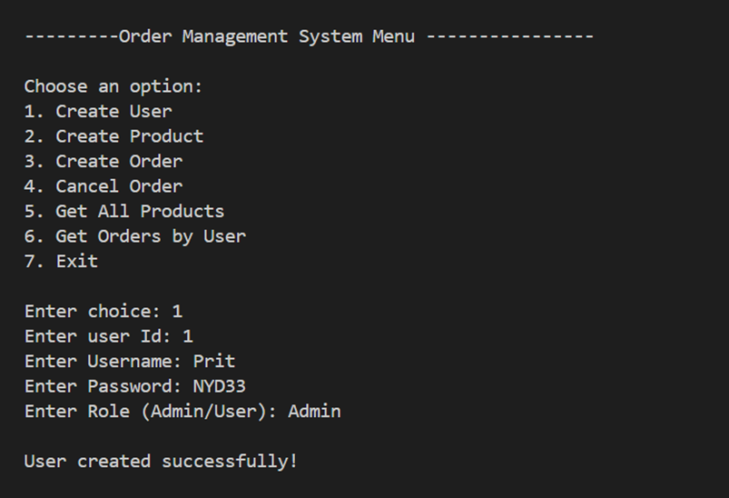
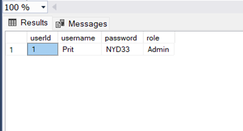
 
 

2.	Adding Product
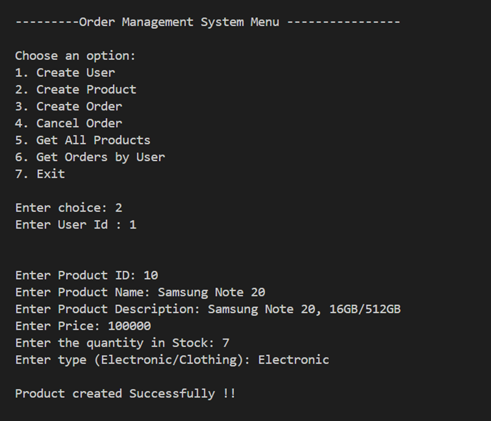
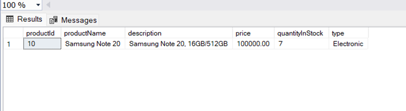
 
-	Product won’t be created if User is not an Admin
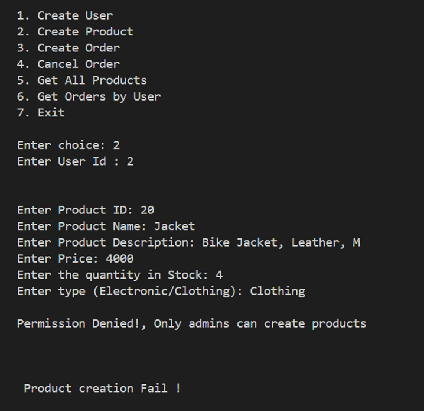
 

3.	Create Order
 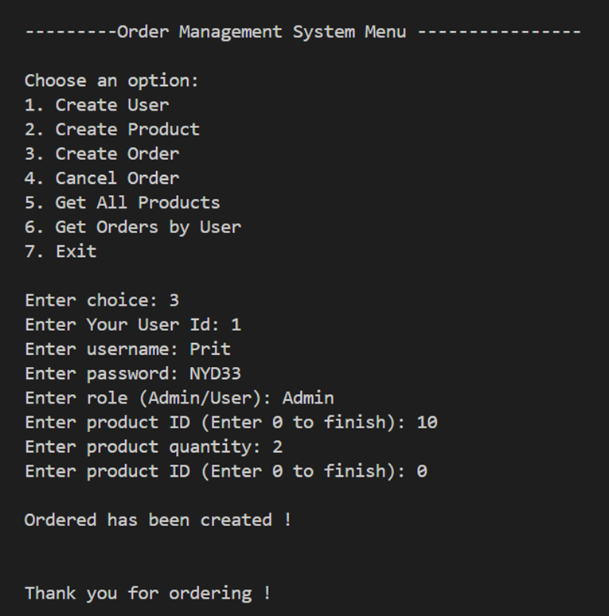
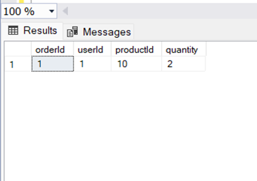
 

4.	Get All Products
 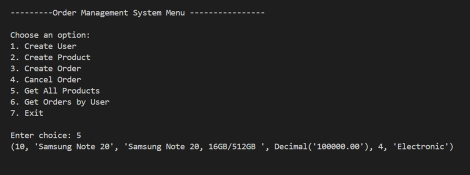

5.	Get Orders by User
 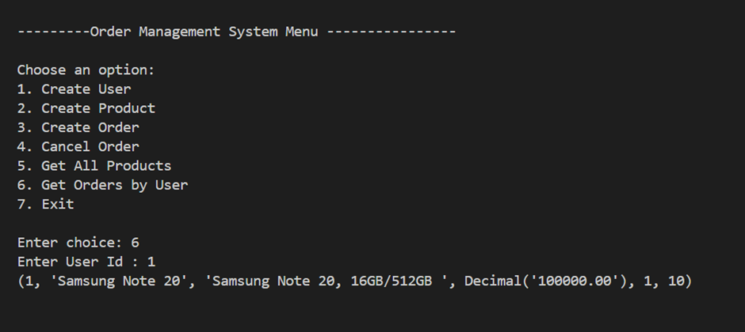

 

6.	Cancel Order
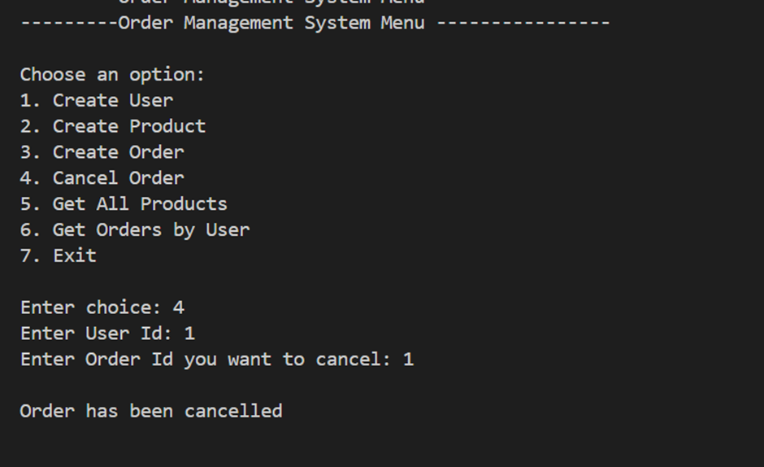
 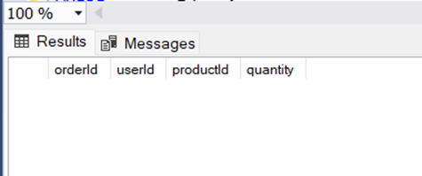

7.	User Not Found Exception
 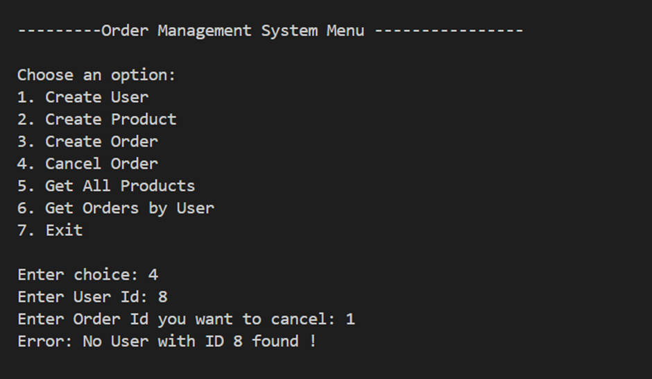

8.	Order Not Found Exception
 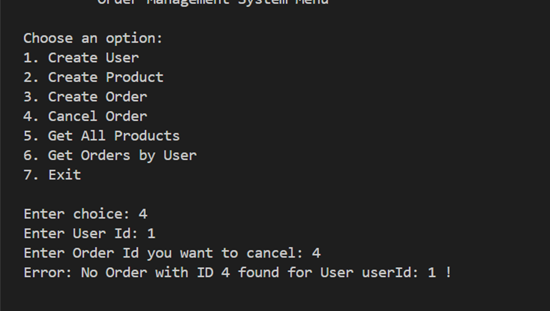
